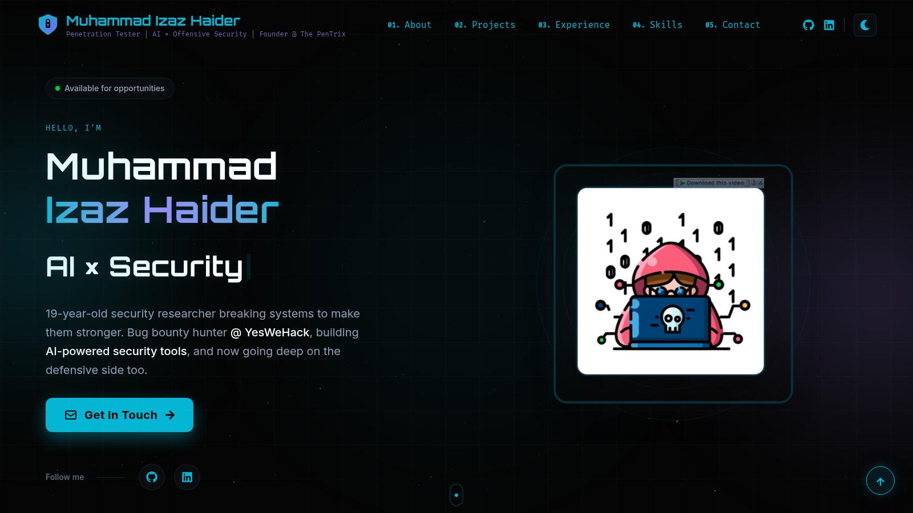
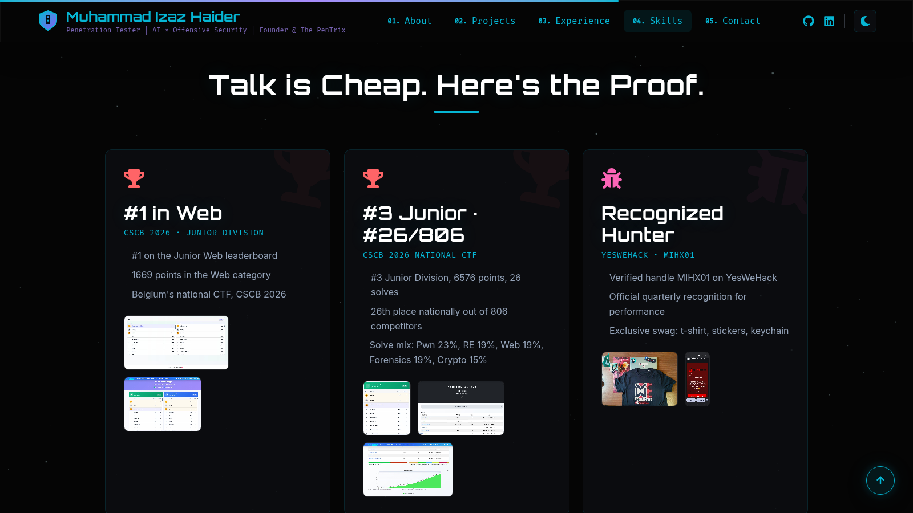
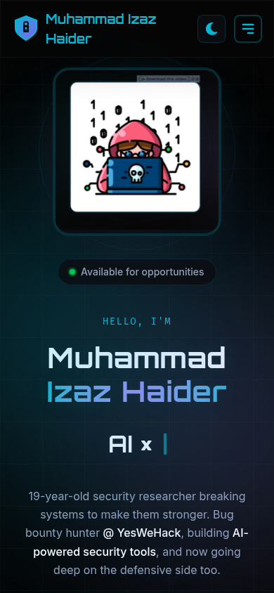

# Muhammad Izaz Haider — Portfolio

My personal portfolio. Pentester, AI x Security researcher, bug bounty hunter, founder of The PenTrix.

**Live:** https://mizazhaider-ceh.dev



## What is inside

- **Hero** with animated typewriter roles and a Three.js particle background (desktop only)
- **Current Focus**: bug bounty at YesWeHack, BSc Cybersecurity at Howest, The PenTrix
- **Projects**: my top 10 builds with filters, live links and GitHub links
- **Experience, Skills, Certifications**: the full track record
- **Proof section**: CSCB 2026 national CTF results and YesWeHack bounties with real screenshots
- **Contact**: working form via Formspree



Five switchable themes (Dark, Light, Matrix, Cyberpunk, Dracula), fully responsive from mobile to ultrawide.



## Tech stack

React 19 + TypeScript + Vite, Tailwind CSS 4, Framer Motion, Three.js, react-icons. Deployed on Vercel with a custom domain. SEO covered: meta tags, Open Graph, JSON-LD structured data, sitemap, robots.txt.

## Run it locally

```bash
npm install
npm run dev
```

Build for production:

```bash
npm run build
```

## Project structure

```
src/
  components/     # Navbar, Hero, About, CurrentFocus, Projects, Experience,
                  # Skills, Certifications, Recognition, Testimonials, Contact, Footer
  styles/         # base, themes (dark/light/matrix/cyberpunk/dracula), glass, animations
  utils/          # shared helpers
public/
  images/         # achievement screenshots, profile art, og image
  resume.pdf      # downloadable resume
screenshots/      # README screenshots
```

## Connect

- GitHub: https://github.com/mizazhaider-ceh
- LinkedIn: https://www.linkedin.com/in/muhammad-izaz-haider-091639314/
- Email: mizazhaiderceh@gmail.com

© 2026 Muhammad Izaz Haider. All rights reserved.
